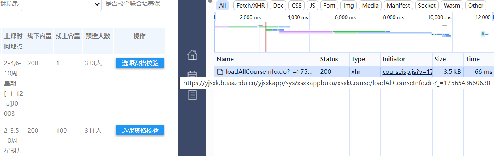

## 用于BUAA预选课系统的选课人数实时查询
因为每次都要去已开课查询，很不方便，写了一个这个。实现思路很简单，就是最简单的查表，所以效率不高，但够用了。

**实验性**，仅用于学术交流，同时**不保证**安全性，请按照学校规定使用。
### 已添加 
   - [x] 学分显示
   - [x] 自动根据已选课程输出

### 使用方法
1. 安装依赖

   ```
   pip install bs4 requests tabulate
   ```

3. 填写用户名与密码
   ```
   authen = {
    'username': ,
    'password': ,
   }
   ```
4. 填写需要查询课程的WID
    ```
    wids = [
    "37EAB9942C577EA3E0630111FE0A1940",
    ]
    ```
5. 运行  
   run main.py  
   对于windows cmd
   ```
   @echo off
   call %pathtoPython%\python.exe "%pathtosrc%\main.py"
   pause
   ```
6. 效果  
   


### 拓展
   首先，课程信息的格式为：
   ```
   "WID":"8a127fee732e4a5b9a3973dae6bc82ec", #唯一ID
   "KCDM":"D011026B31", #课程代码
   "KCMC":"AI+材料",  #课程名称
   "BJDM":"20251-010100-D011026B31-1750040651792",
   "BJMC":"1班",
   "RKJS":"李圳,郑蕾,刘禺,康鹏",
   "XNXQDM":"20251",
   "XNXQMC":"2025-2026学年 第一学期",
   "KCZXS":16,
   "KCKKDWDM":"010100",
   "KCKKDWMC":"010100 材料科学与工程学院",
   "XQMC":"沙河校区",
   "SKXSMC":"面授讲课",
   "RWKKDWDM":"010100",
   "RWKKDWMC":"010100 材料科学与工程学院",
   "XQDM":"shxq",
   "KCXF":1, #课程学分
   "KCFLDM":"4",
   "KCCCDM":"7",
   "KCCCMC":"博士/硕博通用",
   "SFBKSKX":0,
   "YJSZDRL":99999,
   "DYYJXKDM":",0,",
   "KCXZDM":"1",
   "KCXZDM2":"26",
   "SFYXQZTK":1,
   "SFTJDKXJXB":1,
   "SFYXXSSK":0,
   "XSRL":1, #线上容量
   "KXRS":200, #线下容量
   "DQRS":0,
   "YXBKXSSL":0,
   "YXYJSXSSL":0,
   "YXXSRS":0,
   "YXXKJGRS":321, #预选人数
   "PKSJ":"2-4,6-10周 星期二[11-12节]",
   "PKDD":"J0-003",
   "PKSJDD":"2-4,6-10周 星期二[11-12节]J0-003",
   "PKSJDDMS":"2-4,6-10周 星期二[11-12节]J0-003"}
   ```
  所以，这边只显示了线下容量，同样可以用加法显示总容量，因为对我用处不大就没加。  
  同时学分显示、搜索功能等一系列功能也可以实现。

   ~~对于获取cookie的部分，显得有些多余，这是因为一开始是直接加cookie的，后面的版本才用了进程，所以就缝缝补补懒得改了hhh~~

   ### 获取WID（这个已经废弃）
1. 打开选课网址，登录好，按`F12`打开开发者工具，点击“已开课程查询”，获取url  
   形如`https://yjsxk.buaa.edu.cn/yjsxkapp/sys/xsxkappbuaa/xsxkCourse/loadAllCourseInfo.do?_=时间戳`  
   
2. 修改网址为  
   `https://yjsxk.buaa.edu.cn/yjsxkapp/sys/xsxkappbuaa/xsxkCourse/loadAllCourseInfo.do?_=时间戳&pageSize=2367`  
   这边2367就是当前所有课程总数"total":2367  
3. 按`Ctrl+F`搜索，选择正确的课程即可获取WID  
~~P.S. 这个思路和代码实现逻辑一样，获取到json同样可以做搜索，这一步感觉可以直接加到代码中。~~（已添加）
   
